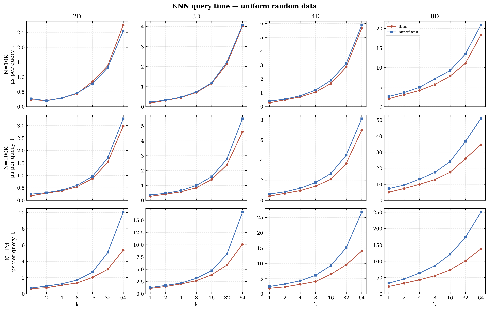
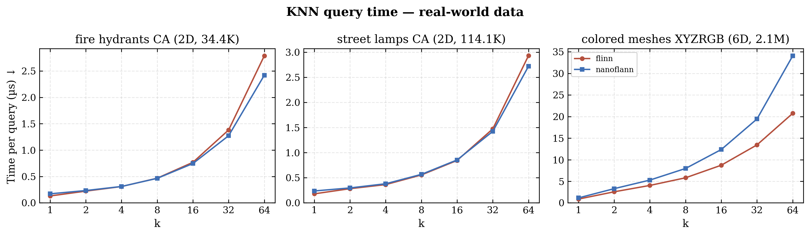

# FLINN - Fast Lightweight Incremental Nearest Neighbours

I previously wrote a very high performance KD-tree in Java, but these days I work mostly with C++. I hadn't yet found one with a simple API that is also fast and doesn't bring a bunch of dependencies or a weird build system, so I decided to write my own. It's based roughly on what I did in the Java tree, but of course with a bunch of optimizations that weren't possible in Java.

It's a single C++11 header file, depends only on the STL. You template it on your data type, dimensions, and distance metric, and everything gets stored directly in the tree.

It allows dynamic insertion of points, followed by queries, then insertion of more points (at the expense of some performance). This is useful for problems where queries are interspersed with new data and rebuilding the tree every time isn't viable. In domains like time series and behavioral prediction, the ground truth often arrives shortly after the prediction is made, so you can incorporate new observations immediately and keep the model accurate even as the data drifts. I wrote more about this here: [Low Latency Adaptive ML with KNN](https://jkflying.net/posts/low_latency_adaptive_ml/)

## Features

- Header-only, single file
- C++11
- Dynamic insert and remove
- KNN, ball, and hybrid search (`searchKnn`, `searchBall`, `searchCapacityLimitedBall`)
- Templated on payload type, dimensions, bucket size, distance metric, and scalar type
- No dependencies outside the STL
- Iterator support
- `rebalance()` to rebuild the tree after many insertions

## Example usage

```cpp
#include <flinn.h>
#include <iostream>
#include <cmath>

// setup
using tree_t = flinn::FlinnIndex<std::string, 2>;
using point_t = std::array<double, 2>;
tree_t tree;
tree.addPoint(point_t{{1, 2}}, "George");
tree.addPoint(point_t{{1, 3}}, "Harold");
tree.addPoint(point_t{{7, 7}}, "Melvin");

// KNN search
point_t lazyMonsterLocation{{6, 6}}; // this monster will always try to eat the closest people
const std::size_t monsterHeads = 2; // this monster can eat two people at once
auto lazyMonsterVictims = tree.searchKnn(lazyMonsterLocation, monsterHeads);
for (const auto& victim : lazyMonsterVictims)
{
    std::cout << victim.payload << " closest to lazy monster, with distance " << sqrt(victim.distance) << "!"
              << std::endl;
}

// ball search
point_t stationaryMonsterLocation{{8, 8}}; // this monster doesn't move, so can only eat people that are close
const double neckLength = 6.0; // it can only reach within this range
auto potentialVictims = tree.searchBall(stationaryMonsterLocation, neckLength * neckLength); // metric is SquaredL2
std::cout << "Stationary monster can reach any of " << potentialVictims.size() << " people!" << std::endl;

// hybrid KNN/ball search
auto actualVictims
    = tree.searchCapacityLimitedBall(stationaryMonsterLocation, neckLength * neckLength, monsterHeads);
std::cout << "The stationary monster will try to eat ";
for (const auto& victim : actualVictims)
{
    std::cout << victim.payload << " and ";
}
std::cout << "nobody else." << std::endl;
```

Output:

    Melvin closest to lazy monster, with distance 1.41421!
    Harold closest to lazy monster, with distance 5.83095!
    Stationary monster can reach any of 1 people!
    The stationary monster will try to eat Melvin and nobody else.

Build:

```bash
cd C++
mkdir build && cd build
cmake ..
make
./flinn_test
```

## Benchmarks

Even though Flinn is built for incremental insertion, bulk performance is still good. With all points inserted up front it's about as fast as [nanoflann](https://github.com/jlblancoc/nanoflann) for small K in low dimensions, and faster once you start increasing either.

Uniform random data (batch insert, then query):



Real-world datasets (geographic coordinates, colored 3D meshes):



Benchmarks run KNN queries over 10K pre-generated query points, sampling each configuration for 500ms. See [`C++/bench/`](C++/bench/) for the benchmark source and plotting script.

## Tuning Tips

If you need to add a lot of points before doing any queries, set the optional `autosplit` parameter to false,
then call `splitOutstanding()`. This will reduce temporaries and result in a better balanced tree.

Set the bucket size to be at least twice the K in a typical KNN query. If you have more dimensions, it is better to
have a larger bucket size. 32 is a good starting point. If possible use powers of 2 for the bucket size.

If you experience linear search performance, check that you don't have a bunch of duplicate point locations. This
will result in the tree being unable to split the bucket the points are in, degrading search performance.

The tree adapts to the parallel-to-axis dimensionality of the problem. Thus, if there is one dimension with a much
larger scale than the others, most of the splitting will happen on this dimension. This is achieved by trying to
keep the bounding boxes of the data in the buckets equal lengths in all axes.

Random data performs worse than 'real world' data with structure. This is because real world data has tighter
bounding boxes, meaning more branches of the tree can be eliminated sooner. On pure random data, more than 7 dimensions
won't be much faster than linear. However, most data isn't actually random. The tree will adapt to any locally reduced
dimensionality, which is found in most real world data.

If you are performing many searches in a loop, use `tree.searcher()` to get a reusable `Searcher` object. This amortizes
the allocation of the search stack and results vector across calls, rather than allocating and freeing them every query.

Hybrid ball/KNN searches are faster than either type on its own, because subtrees can be more aggresively eliminated.

## API Reference

```cpp
flinn::FlinnIndex<Payload, Dimensions, BucketSize=32, Distance=SquaredL2, Scalar=double>

void addPoint(const point_t& location, const Payload& payload, bool autosplit = true);
bool removePoint(const point_t& location, const Payload& payload);
void splitOutstanding();  // split all pending buckets (use after autosplit=false inserts)
void rebalance();         // rebuild tree structure from current points

std::vector<DistancePayload> searchKnn(const point_t& location, std::size_t k) const;
std::vector<DistancePayload> searchBall(const point_t& location, Scalar maxRadius) const;
std::vector<DistancePayload> searchCapacityLimitedBall(const point_t& location, Scalar maxRadius, std::size_t k) const;
DistancePayload search(const point_t& location) const;  // single nearest neighbour

Searcher searcher() const;  // reusable, avoids repeated allocation
const std::vector<DistancePayload>& Searcher::search(const point_t& location, Scalar maxRadius, std::size_t maxPoints);

Iterator begin() const;
Iterator end() const;
size_t size() const;

// distance functors: flinn::SquaredL2 (default), flinn::L1
```

## License

[Mozilla Public License 2.0](LICENSE.txt)

You may use this in any software provided you give attribution. You must make available any changes you make to flinn.h to anybody you distribute your software to.

Upstreaming features and bugfixes are highly appreciated! If you end up using this, I'd love to hear about it and the problems you're solving.
